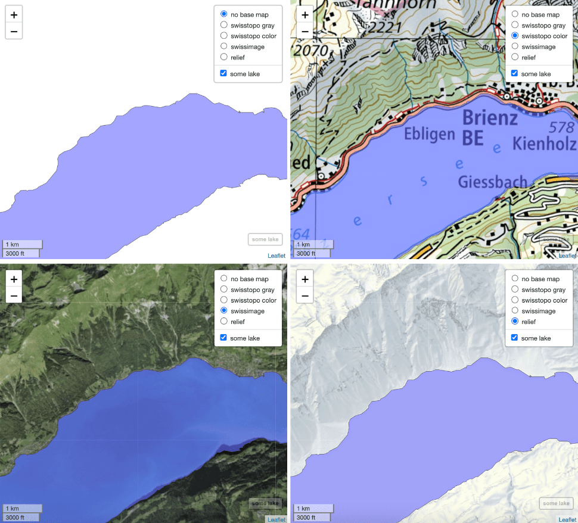
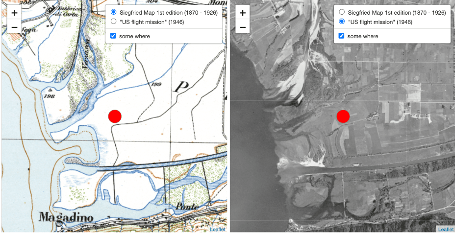

<!-- README.md is generated from README.Rmd. Please edit that file -->

```{r, include = FALSE}
knitr::opts_chunk$set(
  collapse = TRUE,
  comment = "#>",
  fig.path = "man/figures/README-",
  out.width = "100%"
)
```

# leaflet.CH.basemaps: Add Swiss Base Maps to Interactive Web Maps

<!-- badges: start -->
<!-- badges: end -->

`leaflet.CH.basemaps` includes functions in R for adding 16 different Swiss base
maps, provided by [swisstopo](https://map.geo.admin.ch), to interactive web maps.
Most of these base maps are not accessible via [leaflet-providers](https://leaflet-extras.github.io/leaflet-providers/preview/index.html). `add_base_maps()`, the package's core function, allows adding a selection of base
maps to an object of the class [`leaflet`](https://rstudio.github.io/leaflet/),
[`mapview`](https://r-spatial.github.io/mapview/) or [`tmap`](https://r-tmap.github.io/tmap/). Furthermore, for each of selectable base maps there is a specific function,
enabling adding it to an existing map.

## Installation

``` r
# install package remotes if not yet installed
# install.packages("remotes")

# install fast and easy from GitHub (not recommended)
# remotes::install_github("a-benini/leaflet.CH.basemaps")

# recommended: installation from GitHub including suggested packages
# (to run examples without surprises):
remotes::install_github(
  "a-benini/leaflet.CH.basemaps",
  build_vignettes = TRUE,
  dependencies = c("Imports", "Suggests")
  )
```

## Example

Add the default selection of base maps to an existing interactive map:

``` r
library(leaflet)
library(mapview)
library(leaflet.CH.basemaps)

# a mapview obj.
m <- mapview(lakes[10,], layer.name = "some lake", legend = FALSE) 

m %>%
  add_base_maps() %>%   # returns leaflet obj. 
  setView(8, 46.75, 13) # further manipulation of leaflet obj. possible
```


Note that by default _no base map_ and four base maps are added. The top listed
_no base map_ is an empty background according to the set background color 
(argument `bg_col`), which is by default white.

Modifying the selection, sequence and user-defined naming of base maps is possible
with  `add_base_maps()`:

``` r
library(sf)
library(tmap)

# a point ...
some_where <- c(2710200, 1113350) %>% st_point() %>% st_sfc(crs = 2056)
# a tmap obj.
tm <- 
  some_where %>% 
  tm_shape(., bbox = st_buffer(., units::set_units(1.5, "km"))) +
  tm_dots(col = "red", size = 0.5, group = "some where")

tm %>%
  add_base_maps(
    baseGroups = c("siegfried_map", "swissimage_1946"),
    baseGroupNames = c('Siegfried Map 1st edition (1870 - 1926)', '"US flight mission" (1946)')
  )
```


Note that by default predefined group names of base maps are in English.
Switching to predefined in layer/group names in German, French, Italian or 
Rhaeto-Romance is possible by `add_base_maps()`'s argument `language`.
